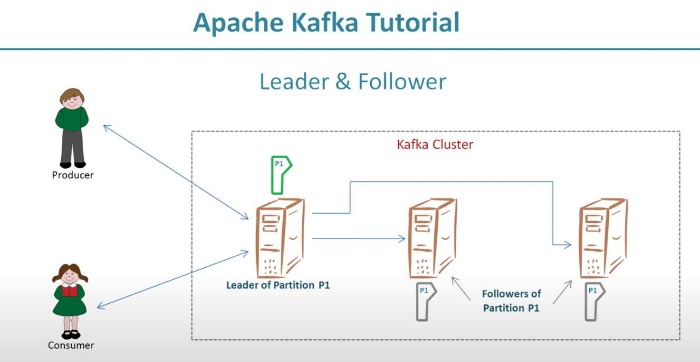

Fault Tolerance: 

    1. Fault Tolerance is enabling a system to continue operating properly in the event of the failure of some of its components.
    
    2. It is mechanism of making data available in scenario's of failure
    
    3. You acheive it by configurign replication factor 
    
    4. replication factor is set for a topic and it is no of copies of the message
    
    5. Kafka implements concept of leader and follower
    
    5. Producer/Consumer interact with leader for data processing
    
    6. copies of the data are stored with followers
    
       
        

             
        

    

        
